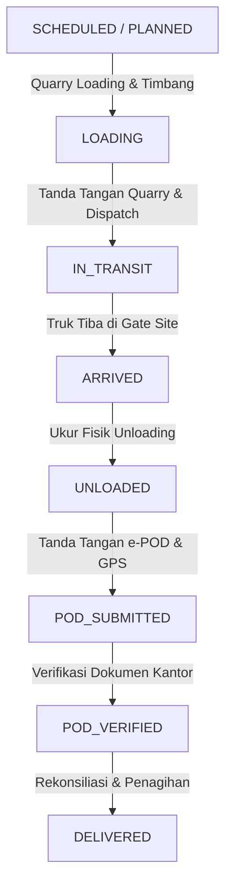

# AGENTS.md — Panduan Audit & Pengembangan Sistem REV Bumi OS

Dokumen ini merupakan panduan arsitektur, domain operasional, aturan bisnis, dan referensi implementasi **REV Bumi OS** untuk agen AI dan pengembang berikutnya.

---

## 1. Ringkasan Sistem & Domain Bisnis
**REV Bumi OS** adalah Sistem Operasi Rantai Pasok Material Konstruksi (Agregat Batu Split, Base Course, Pasir Cor, Abu Batu, Makadam) terintegrasi untuk **PT REV Bumi Nusantara Perkasa**.

Sistem ini menjembatani 3 pilar operasional agregat:
1. **Operasional Quarry & Pengaturan Armada**: Pemuatan agregat di quarry (Rumpin, Sudamanik, Bojonegara), pencatatan vendor angkutan, penimbangan jembatan timbang/dimensi bak truk, dan penerbitan Surat Jalan.
2. **Operasional Site Proyek & e-POD**: Penerimaan truk di lokasi proyek BUMN/Swasta (Tol, Bendungan, LRT), verifikasi kubikasi fisik ($m^3$), evaluasi ambang batas toleransi susut kontrak ($\le 2\%$), penguncian GPS, dan penerbitan bukti serah terima digital (*e-POD*).
3. **Komersial, Rekonsiliasi & Keuangan**: Rekonsiliasi quantity multi-lokasi, perhitungan ongkos angkut vendor (*freight cost*), pembuatan tagihan pelanggan (*customer invoice*), pemotongan penalti susut di atas toleransi, dan audit trail perubahan data yang tidak terhapuskan.

---

## 2. Struktur Peran & Hak Akses (Role-Based Access Control)
Peran pengguna terbagi menjadi **8 Role Pengguna** (tanpa login supir individu, supir dicatat di bawah vendor armada):

| Role Code | Nama Peran | Hak Akses Utama |
|---|---|---|
| `SUPER_ADMIN` | Super Administrator | Akses penuh ke seluruh modul, konfigurasi sistem, dan persetujuan koreksi audit. |
| `MANAGEMENT` | Direksi & Manajemen | Analitik eksekutif, profit margin proyek, laporan margin kotor, dan persetujuan kontrak. |
| `OPERATIONS` | Operasional & Logistik | Monitoring ritase, penugasan armada, rekonsiliasi quantity, dan investigasi deviasi. |
| `COMMERCIAL` | Komersial & Kontrak | Manajemen pelanggan, kontrak proyek, harga material, plafon toleransi, dan addendum. |
| `FINANCE` | Keuangan & Penagihan | Penagihan invoice pelanggan, settlement ongkos angkut vendor, pelunasan, dan rekonsiliasi margin. |
| `DISPATCHER` | Dispatcher Logistik | Penjadwalan ritase truk harian, monitoring armada in-transit, dan alokasi vendor. |
| `QUARRY_CHECKER` | Petugas Lapangan Quarry | **Aplikasi Mobile/PWA**: Entri jadwal ritase baru, cari vendor ready, input jembatan timbang (Gross/Tare), input dimensi bak, dan berangkatkan armada (*In-Transit*). |
| `SITE_CHECKER` | Petugas Lapangan Site | **Aplikasi Mobile/PWA**: Konfirmasi kedatangan truk di site, input kubikasi unloading, penguncian GPS, tanda tangan digital, dan penerbitan e-POD. |

---

## 3. Alur State Machine Pengiriman (Delivery Lifecycle)



- **`SCHEDULED`**: Ritase dijadwalkan oleh dispatcher atau dibuat langsung oleh petugas quarry di mobile PWA.
- **`LOADING`**: Truk berada di quarry, dalam proses penimbangan jembatan timbang (*Gross / Tare*) atau pengukuran dimensi bak ($P \times L \times T$).
- **`IN_TRANSIT`**: Petugas quarry telah menandatangani surat jalan dan memberangkatkan armada menuju site proyek.
- **`ARRIVED`**: Petugas site mengonfirmasi kehadiran truk di gerbang proyek via GPS lock.
- **`UNLOADED`**: Muatan dibongkar dan diukur kubikasi fisiknya di seksi proyek.
- **`POD_SUBMITTED`**: Petugas site dan supir membubuhkan tanda tangan digital di layar mobile untuk menerbitkan e-POD.
- **`POD_VERIFIED` / `DELIVERED`**: Dokumen tervalidasi dan siap ditagihkan ke invoice serta dihitung ongkos angkut vendor.

---

## 4. Mesin Perhitungan Kritis (Calculation Engines)

### A. Quantity & Variance Engine (`src/engine/quantity.engine.ts`)
1. **Konversi Timbangan ke Kubikasi**:
   $$\text{Netto Kg} = \text{Gross Kg} - \text{Tare Kg}$$
   $$\text{Volume } (m^3) = \frac{\text{Netto Kg} / 1000}{\text{Densitas Material } (\text{ton}/m^3)}$$
2. **Perhitungan Dimensi Bak Truk**:
   $$\text{Volume Bak } (m^3) = \text{Panjang } (m) \times \text{Lebar } (m) \times \text{Tinggi Rata-rata } (m)$$
3. **Evaluasi Toleransi Susut Kontrak**:
   $$\text{Selisih } (m^3) = \text{Volume Muat Quarry } (m^3) - \text{Volume Terima Site } (m^3)$$
   $$\text{Persentase Selisih } (\%) = \left(\frac{\text{Selisih } (m^3)}{\text{Volume Muat Quarry } (m^3)}\right) \times 100$$
   - **Jika $|\text{Persentase}| \le \text{Toleransi Kontrak } (\text{default } 2\%)$**: `WITHIN_TOLERANCE` (Disetujui otomatis).
   - **Jika $|\text{Persentase}| > \text{Toleransi Kontrak}$**: `ABOVE_TOLERANCE` (Memicu investigasi deviasi & penyesuaian komersial).

### B. Freight Engine (`src/engine/freight.engine.ts`)
- **Penentuan Ongkos Angkut Vendor**:
  - `PER_TRIP`: Tarif tetap per ritase.
  - `PER_M3`: $\text{Tarif} \times \text{Volume Terima / Muat}$.
  - `PER_TON`: $\text{Tarif} \times \text{Tonase Muatan}$.
- **Pemotongan Penalti Susut Vendor**:
  - Jika selisih melebihi toleransi kontrak tanpa alasan force majeure, volume selisih berlebih dapat dipotongkan dari tagihan vendor angkutan.

### C. Finance & Invoicing Engine (`src/engine/finance.engine.ts`)
- **Penagihan Pelanggan**:
  $$\text{Dasar Tagihan } (m^3) = \min(\text{Volume Muat}, \text{Volume Terima})$$ *(atau sesuai klausul kontrak Basis Invoice)*
  $$\text{Subtotal Penjualan} = \text{Dasar Tagihan } (m^3) \times \text{Harga Jual Kontrak } (\text{Rp}/m^3)$$
  $$\text{PPN } 11\% = \text{Subtotal} \times 0.11$$
  $$\text{Total Invoice} = \text{Subtotal} + \text{PPN} - \text{Potongan Klaim Deviasi}$$

---

## 5. Struktur Direktori Proyek

```
/
├── AGENTS.md                  # Panduan agen & audit instruksi sistem
├── DOCUMENTATION.md           # Dokumentasi teknis & operasional lengkap
├── metadata.json              # Metadata aplikasi & permissions
├── package.json               # Dependensi proyek
├── src/
│   ├── App.tsx                # Routing utama & State wrapper
│   ├── main.tsx               # React DOM Entry
│   ├── index.css              # Tailwind CSS configuration
│   ├── types/
│   │   └── index.ts           # Definisi interface TypeScript global
│   ├── context/
│   │   └── AppContext.tsx     # Centralized State Store & Business Actions
│   ├── engine/                # Core calculation & business rule engines
│   │   ├── contract.engine.ts
│   │   ├── finance.engine.ts
│   │   ├── freight.engine.ts
│   │   ├── quantity.engine.ts
│   │   └── state-machine.engine.ts
│   ├── data/
│   │   └── seedData.ts        # Data awal realistis industri agregat
│   ├── lib/
│   │   ├── formatters.ts      # Pemformat mata uang (IDR), m³, ton, tanggal
│   │   └── utils.ts           # Utility helper functions
│   └── components/
│       ├── layout/            # Navbar, Sidebar, Page Container
│       ├── dashboard/         # Executive Cockpit & Real-Time Monitoring
│       ├── mobile/            # Mobile Field PWA (Dashboard, Quarry, Site, e-POD)
│       ├── operations/        # Delivery Registry, Dispatch, GPS Tracking
│       ├── logistics/         # Manajemen Vendor Armada, Kendaraan & Tarif
│       ├── commercial/        # Pelanggan, Proyek, Kontrak & Aturan Penagihan
│       ├── finance/           # Invoicing, Vendor Settlement & Reconciliation
│       ├── reports/           # Ekspor Excel, PDF, Rekonsiliasi Kubikasi
│       ├── master/            # Master Material, Quarry, Customer, Vendor
│       ├── audit/             # Immutable Audit Log & Koreksi Transaksi
│       └── common/            # Signature Pad, Modals, Status Badges, KPI Cards
```

> **Catatan backend (Supabase):** struktur web/mobile kini berada di monorepo `rev-bumi-os/` (`apps/web`, `apps/mobile`, `packages/*`). Skema database dikelola sebagai **SQL migration** di folder `supabase/migrations/`, dan logika server-side (verifikasi GPS, timestamp server, webhook) sebagai **Edge Functions** di `supabase/functions/`. Rincian fase: `ROADMAP.md`.

---

## 6. Backend, Data Layer & Deployment (Keputusan Arsitektur)

- **Backend saat ini: Supabase** — PostgreSQL terkelola + Auth (JWT) + Row Level Security (RLS) + Realtime + Storage (foto bukti/tanda tangan) + Edge Functions. Digunakan pada **free tier** untuk development & operasional awal.
- **Target akhir: deployment penuh di cloud GCP / Alibaba Cloud** — migrasi bertahap (lihat `ROADMAP.md` §4-Fase 4 & §5), bukan tulis ulang. Supabase adalah Postgres → jalur ke GCP Cloud SQL / Alibaba RDS tetap mulus.
- **Web & PWA**: Vercel (free) sekarang → GCP Cloud Run / Alibaba saat produksi penuh.
- **Data flow**: aplikasi web & mobile berbicara ke Supabase via `@supabase/supabase-js`; RLS menegakkan hak akses 8 role di level database; Realtime menyinkronkan ritase/status dari lapangan ke cockpit kantor.
- **Portabilitas**: skema & RLS ditulis dalam **SQL standar yang ter-versioning**; akses data dienkapsulasi agar backend bisa ditukar (Supabase SDK ↔ REST/Prisma) via konfigurasi (env-driven) tanpa mengubah kode aplikasi.

---

## 7. Aturan Penting untuk Agen Selanjutnya
1. **Jangan Membuat Role Login Supir Truk**: Pengemudi adalah mitra dari Vendor Transportasi luar. Data supir (`driverName`, `driverPhone`, `plateNumber`) dicatat pada saat pengaturan ritase oleh Petugas Quarry.
2. **Pertahankan Dual-Platform (Desktop Cockpit + Mobile Field PWA)**:
   - Pengguna desktop memantau dari modul Dashboard, Operasional, Komersial, dan Keuangan.
   - Petugas lapangan menggunakan `MobileDriverApp` dengan 5 tab: **Dashboard**, **Ritase**, **1. Quarry**, **2. Site**, dan **Rekonsil**.
3. **Audit Trail Immutability**: Semua penambahan, pengubahan, pembatalan pengiriman, atau penyesuaian kubikasi **wajib** mencatat entri log ke `auditLogs` dengan informasi *actor*, *timestamp*, *reason*, *oldValues*, dan *newValues*. Saat di Supabase: tabel `audit_logs` **insert-only via RLS** (tanpa update/delete).
4. **Backend Supabase & Portabilitas Cloud**:
   - Akses data lewat **Supabase SDK/PostgREST**, jangan menulis API CRUD sendiri di server.
   - Tulis **SQL migration** untuk setiap perubahan skema (versioning), bukan edit langsung.
   - RLS menegakkan 8 role di level database; jangan hanya andalkan validasi UI.
   - Hindari fitur eksklusif provider agar tetap portabel ke GCP/Alibaba; semua konfigurasi **env-driven**.
5. **Verifikasi Build & Lint**: Selalu jalankan `lint_applet` dan `compile_applet` setelah melakukan perubahan kode untuk memastikan tidak ada pemutusan tipe TypeScript.
6. **UI/UX Iconography**: Selalu gunakan **react-icon** (`lucide-react` web, `lucide-react-native` mobile) — **jangan pakai emoji** (`📊⛏️🏗️🧾💰⚠️📈🚚` dkk). Emoji tidak konsisten warna/size dan tidak scalable; icon vektor via props `size`/`color`.
7. **Auto-Push ke Git (Produksi)**: Setiap perubahan kode yang lolos `check-types` + `lint` **wajib langsung commit & push ke `origin/main`** tanpa menunggu instruksi manual. Vercel `rev-bumi-os-v2-web` auto-deploy dari `main`. Jangan menumpuk perubahan lokal. Pesan commit: `fix|feat|chore(scope): deskripsi singkat`.
